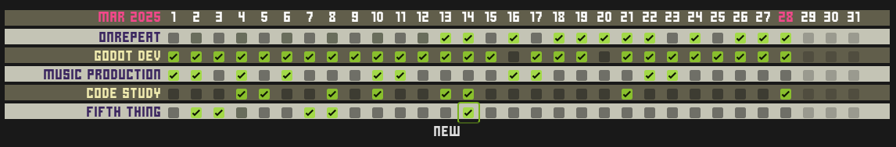

# onrepeat

This is meant to be a low touch habit tracker in the same vein as simple paper based habit trackers. Development is currently in progress and key functionality is still missing.

Creates a basic checkbox grid for the days of the current month, against the names of the habits being tracked. On performing the desired habit, check off the habit for the current day.

### Planned

* generate a new month on first of the month
* create a new habit
* modify an existing habit (rename, disable, delete)
* default theme

### Future Considerations

* current streak tracking per habit
* all time streak tracking per habit
* view previous months
* restore a disabled habit
* custom theming